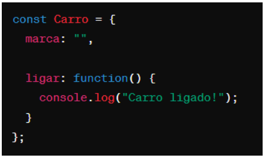

# Instruções

- Faça uma cópia deste arquivo .md para um repositório próprio
- Resolva as 6 questões objetivas assinalando a alternativa correta
- Resolva as 4 questões dissertativas escrevendo no próprio arquivo .md
  - lembre-se de utilizar as estruturas de código como ``esta aqui com ` `` ou
```javascript
//esta aqui com ```
let a = "olá"
let b = 10
print(a)
```
- Resolva as questões com uso do Visual Studio Code ou ambiente similar.
- Teste seus códigos antes de trazer a resposta para cá.
- Cuidado com ChatGPT e afins: entregar algo só para ganhar nota não faz você aprender e ficar mais inteligente. Não seja dependente da máquina!
- ao final, publique seu arquivo lista_01.md com as respostas em seu repositório, e envie o link pela Adalove. 

# Questões objetivas

**1)** O que o código a seguir faz?


Escolha a opção que responde corretamente:

R: Este código faz uma verificação utilizando um laço de repetição WHILE, enquanto a variável numero for menor que o número 10, faz um incremento. Se os números da variável forem pares, imprimem no console, como vão ser números de 1 a 10, o console irá imprimir só os numeros pares de 1 a 10. 

X) Imprime os números pares de 1 a 10.

b) Imprime os números ímpares de 1 a 10.

c) Imprime os números pares de 2 a 10. - resposta correta

d) Imprime os números ímpares de 2 a 10.

______

**2)** Identificar a linha que falta no código para criar uma classe Veiculo com atributo marca, e uma classe Carro que herda de Veiculo com um método ligar(). 


No lugar onde está escrito “// linha” qual das opções abaixo deve estar para funcionar corretamente o código?

R = a linha que falta é criar o objeto da classe Carro, quando criamos um objeto é preciso criar uma variável e atribuir à classe, adicionando o new e depois o nome da classe e nesse caso adicionar o valor do atributo.

X) let carro = new Carro("Toyota");

B) let ligar = new ligar("Toyota");

C) class Moto extends Veiculo {};

D) carro1.ligar();

______

**3)** Qual é o valor de resultado após a execução deste código?


Escolha a opção que responde corretamente:

R = Este código tem a variável resultado = 0, e usa um laço de repetição for, que faz um decremento de dois em dois para i >= 0. Nisso, ele acrescenta em o valor atual do i na variável resultado. E tem como condição se o i do for, for igual === 6, o código para. Com isso o primeiro valor que a variável resultado vai ter é 10, depois vai incrementar mais 8 e depois o código para no 6.

X) 18

B) 16

C) 14

D) 12

______

**4)** Como você criaria um método `acelerar()` em uma classe `Carro`, que recebe um parâmetro `velocidade` e o adiciona a um atributo `velocidadeAtual`?

R = A alternativa A é a única correta pois atende todos os requesitos do enunciado. As outras alternativas começam com function e a última declara a classe com o nome errado.

X) 

B) 

C) 

D) 

______

**5)** Qual a forma correta de definir uma classe Carro em JavaScript, com um método ligar() e um atributo marca?

R = Usando a mesma lógica da questão anterior, a única alternativa que atende todos os requesitos é a alternativa A. As outras não iniciam como classe e sim função ou variável.

X) 

B) 

C) 

D) 

______

**6)** Observe o código abaixo:


Qual será a saída do código acima?

R = No metódo greet, a mensagem de retorno será 'Olá, mei nome é (atributo name)'.

X) "Olá, meu nome é João. Olá, meu nome é Maria."

B) "Olá, meu nome é ."

C) "João Maria"

D) "undefined undefined"

______

# Questões dissertativas

**7)** Vamos criar um programa em JavaScript para entender classes, métodos e atributos!
Classe Animal:
- Crie uma classe chamada Animal.
- Adicione dois atributos: nome e idade.
- Adicione um método chamado descrever() na classe Animal.
  - Este método deve exibir no console uma descrição do animal com seu nome e idade.

Criando e manipulando Animais:
- Crie dois objetos da classe Animal: um chamado "cachorro" e outro "gato", com idades distintas.
- Para cada animal, chame o método descrever() para ver a descrição no console.

Dica: Utilize `console.log()` para exibir as informações!

```

class Animal {

    constructor(nome, idade){

        this.nome = nome;
        this.idade = idade
    }

    descrever(){
    console.log(`o nome do animal é ${this.nome} e a idade é ${this.idade}`)   
}
}

const gato = new Animal("Gato", 5);

const cachorro = new Animal("Cachorro", 15);

gato.descrever();

cachorro.descrever();

______

**8)** Nos últimos dias tivemos a oportunidade de ter contato com Programação Orientada a Objetos, e tivemos contato com o tema "herança". Herança é um princípio de orientação a objetos, que permite que classes compartilhem atributos e métodos. Ela é usada na intenção de reaproveitar código ou comportamento generalizado ou especializar operações ou atributos. Então vamos praticar esse conteúdo nessa questão.
Vamos criar um programa em JavaScript para entender classes, métodos, atributos e herança!

Classe Animal:
- Crie uma classe chamada Animal.
- Adicione dois atributos: nome e idade.
- Adicione um método descrever() que exiba no console uma descrição do animal com seu nome e idade.

Classe Gato (Herda de Animal):
- Crie uma classe chamada Gato que herda da classe Animal.
- Adicione um atributo extra cor específico para gatos.
- Adicione um método miar() que exiba no console o som que um gato faz.

Criando Animais:
- Crie dois objetos da classe Animal: um chamado cachorro e outro gato, com idades distintas.
- Para o gato, também defina a cor.

Chamando os Métodos:
- Para cada animal, chame o método descrever() para ver a descrição no console.
- Para o gato, chame o método miar() para "ouvir" o som que ele faz (é também para ver o som no console).

Dica: Utilize console.log() para exibir as informações!

```

class Animal {

    constructor(nome, idade){

        this.nome = nome;
        this.idade = idade
    }

    descrever(){
    console.log(`o nome do animal é ${this.nome} e a idade é ${this.idade}`)   
}
}

class Gato extends Animal{

    constructor(nome, idade, cor){

        super(nome, idade),
        this.cor = cor;
    }

    miar(){
        console.log('miau');
    }
}


const cachorro = new Animal("Cachorro", 15);

const gato = new Gato("Gato", 5, 'preto');


cachorro.descrever();

gato.descrever();

gato.miar();

______

**9)** Vamos criar um programa em JavaScript para somar notas!

Classe SomadorDeNotas:
- Crie uma classe chamada SomadorDeNotas.
- Adicione um atributo total inicializado com 0 para armazenar a soma das notas.

Método adicionarNota:
- Adicione um método chamado adicionarNota(nota) na classe SomadorDeNotas.
- Este método deve receber um parâmetro nota e somá-lo ao atributo total.

Criando o Somador e Adicionando Notas:
- Crie um objeto da classe SomadorDeNotas, chamado somador.
- Utilize o método adicionarNota(nota) para adicionar algumas notas ao somador.

Chamando o Método para Ver o Total:
- Após adicionar todas as notas, chame um método verTotal() para exibir o total das notas adicionadas.

Dica: Utilize console.log() para exibir as informações!

```

class SomadorDeNotas{
  
    constructor(){
        this.total = 0;
    }

    adicionarNota(nota){
        this.total += nota;
    }

    verTotal(){
        console.log(`notas adicionadas ${this.total}`)
    }
}

const somador = new SomadorDeNotas();

somador.adicionarNota(10);

somador.adicionarNota(8);

somador.adicionarNota(6);

somador.verTotal()


______

**10)** Imagine que você está criando um programa em JavaScript para uma escola. Neste programa, existem diferentes tipos de funcionários, cada um com suas próprias características. Considere as seguintes classes:

Funcionário:
- atributo: Nome
- atributo: Idade
- atributo: Salário base
- método: calcularSalario() - Este método calcula o salário total do funcionário. Para cada tipo de funcionário, o cálculo será diferente.

Professor (herança de Funcionário):
- atributo: Disciplina
- atributo: Horas de aula por semana
- método: calcularSalario() - Para calcular o salário do professor, multiplicamos suas horas de aula pelo valor da hora/aula.

Agora, sua tarefa é escrever um código em JavaScript que crie as classes Funcionário e Professor, com suas características e métodos descritos acima. Depois de criar as classes, crie:
- Dois objetos do tipo Professor com informações fictícias.
- Para cada objeto, chame o método calcularSalario() e mostre o salário calculado no console.

Certifique-se de explicar cada parte do código utilizando comentários, explicando para que serve cada atributo e método, bem como a lógica por trás do cálculo de salário para o tipo de funcionário Professor.


```
// Definindo a classe base para todos os funcionários
class Funcionario {
    // Construtor que inicializa os atributos básicos
    constructor(nome, idade, salarioBase) {
        this.nome = nome;
        this.idade = idade;
        this.salarioBase = salarioBase;
    }

    // Método de cálculo de salário, a ser implementado nas classes derivadas
    calcularSalario() {
        // A implementação específica para cada tipo de funcionário deve ser feita nas classes derivadas.
        // Como o enunciado não pediu nada aqui, deixei como vazio.
    }
}

// Classe derivada Professor que herda de Funcionario
class Professor extends Funcionario {
    // Construtor que inicializa os atributos da classe base e adiciona os específicos para professores
    constructor(nome, idade, salarioBase, disciplina, horasSemana) {
        // Pega o construtor da classe Funcionario base para inicializar os atributos comuns
        super(nome, idade, salarioBase);
        // Inicializa os atributos específicos para professores
        this.disciplina = disciplina;
        this.horasSemana = horasSemana;
    }

    // Método de cálculo de salário específico para professores
    calcularSalario() {
        // Cálculo específico para o salário do Professor: horasSemana * valorHoraAula
        const valorHoraAula = 50; // valor fictício da hora/aula
        const salarioProfessor = this.horasSemana * valorHoraAula;

        // Adicionando o salário base ao salário calculado
        const salarioTotal = salarioProfessor + this.salarioBase;

        // Retornando o salário total
        return salarioTotal;
    }
}

// Criando dois objetos do tipo Professor com informações fictícias
const marco = new Professor("Marco", 30, 3000, "Matemática", 20);
const ana = new Professor("Ana", 25, 2500, "História", 15);

// Chamando o método calcularSalario() para cada objeto e mostrando os salários no console
console.log(`${marco.nome} | Salário: R$${marco.calcularSalario()}`);
console.log(`${ana.nome} | Salário: R$${ana.calcularSalario()}`);
